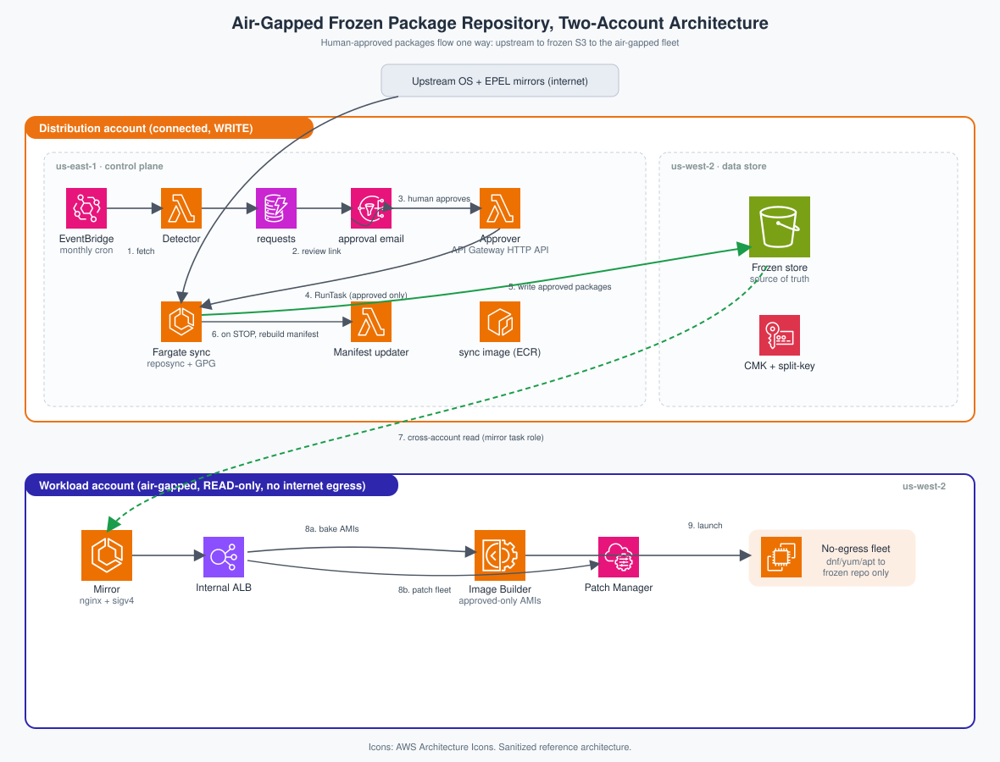
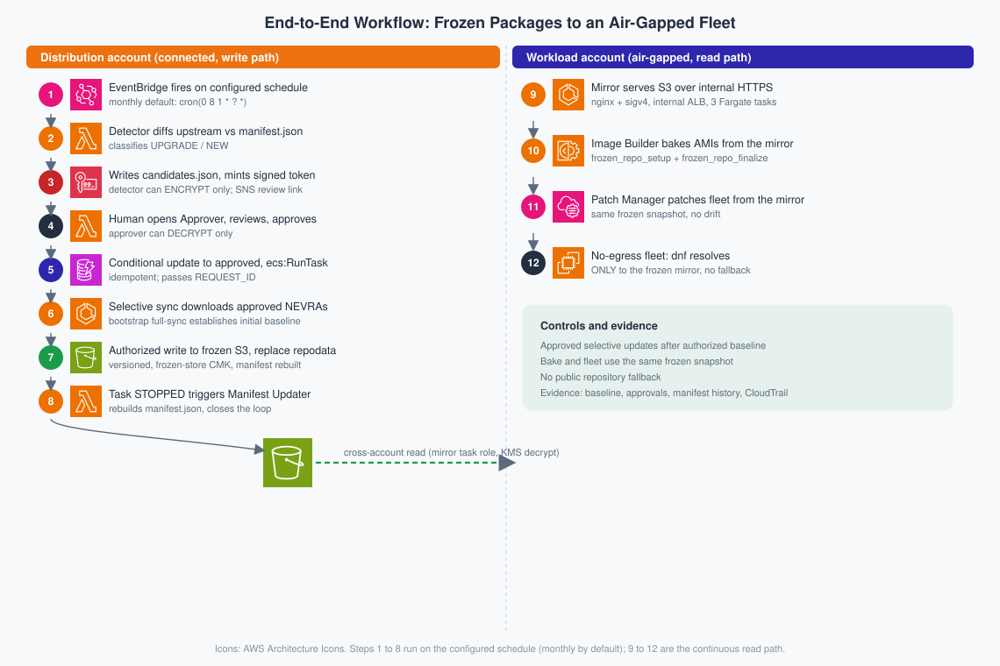

# Frozen Package Repository for Air-Gapped EC2 Image Builds

A sanitized Terraform/Terragrunt reference for an **air-gapped, human-approved OS package pipeline** on AWS. Upstream RHEL-compatible and EPEL content is fetched in a connected account, a human approves specific packages, and only approved packages land in a version-pinned S3 "frozen" repository. EC2 Image Builder bakes golden AMIs from it, and a no-egress fleet resolves every `dnf` / `yum` operation only to it.

> Sanitized reference, not production configuration: every account id, ARN, VPC/subnet id, domain, and email is a placeholder to replace via the Terragrunt input files.

## The three pillars

1. **Frozen package repository (Amazon S3):** an immutable, version-pinned, GPG-verified snapshot of exactly the packages a human approved.
2. **EC2 Image Builder** bakes golden AMIs containing only approved packages; the same frozen state reproduces the same AMI.
3. **No-egress fleet:** every package install, upgrade, and SSM patch resolves only to the frozen mirror. No fallback, by design.

## Architecture



- **Distribution account** (connected, the only writer): frozen S3 bucket (`us-west-2`) + control plane (DynamoDB, KMS, SNS, three Lambdas, Fargate sync task, `us-east-1`). Only this account reaches the internet, only for upstream fetches.
- **Workload account** (air-gapped, read-only): HTTPS mirror, EC2 Image Builder, SSM Patch Manager, the fleet. Reads the bucket cross-account, never writes.

> The two accounts need **no network connectivity**: every cross-account access is an S3/KMS API call authorized by IAM (bucket policy, key policy, `aws:ResourceAccount` / `kms:ViaService` conditions). No peering or Transit Gateway; the VPC CIDRs may even overlap.

## End-to-end workflow



EventBridge fires the **detector** monthly; it diffs each upstream repo against `manifest.json`, writes `candidates.json`, and SNS-emails a KMS-signed review link. A **human approves** specific packages on the review page (API Gateway HTTP API); the **approver** flips the DynamoDB row and starts the **Fargate sync task**, which downloads only approved versions, GPG-verifies every RPM, and writes additively to the frozen bucket under a DynamoDB lock. On task stop, the **manifest updater** rebuilds `manifest.json`. In the workload account the **mirror** (nginx + `aws-sigv4-proxy` behind an internal ALB) serves the bucket over HTTPS; **Image Builder** bakes AMIs from it and **Patch Manager** patches the fleet from the same source, so bake-time and patch-time content never diverge. Token security is split-access KMS: the detector can only Encrypt, the approver can only Decrypt.

## Repository layout

```
frozen-repo-aws/
├── modules/                  # 9 Terraform modules (AWS provider ~> 6.0)
│   ├── frozen-store/  control-plane-data/  sync-engine/
│   ├── detector-lambda/  approver-lambda/  manifest-updater/
│   └── mirror/  patch-manager/  image-builder/
├── lambdas/                  # detector/  approver/  manifest_updater/  (Python)
├── containers/               # sync/ (reposync + GPG verify + S3)  mirror/ (nginx + sigv4)
├── environments/             # Terragrunt layer
│   ├── config.hcl            # THE single "fill these in" file (all real values + os_matrix)
│   ├── root.hcl              # provider (assume-role), remote state, tags
│   ├── _env/                 # per-component module source + stable inputs (DRY)
│   ├── Distribution/{account.hcl, us-west-2/frozen-store, us-east-1/<5 units>}
│   └── Workload/{account.hcl, us-west-2/{mirror, patch-manager, image-builder}}
└── docs/diagrams/
```

The directory path is the configuration: each leaf includes `root.hcl` (provider + assume-role + remote state from `config.hcl`/`account.hcl`) and its `_env/<component>.hcl` (module source + stable inputs), so a leaf carries only what varies. Cross-unit wiring uses `dependency` blocks with `mock_outputs`.

## Prerequisites

Work through these in order. Steps 1-3 are your machine; 4-6 are account networking (missing pieces fail at RUNTIME, not at apply); 7 is optional.

1. **Two AWS accounts**: a connected Distribution account and an air-gapped Workload account.
2. **Tools on the deploy machine**: Terraform >= 1.5, Terragrunt, a container engine (Finch, the default, or Docker), and `python3` + `pip` (`make distribution` vendors Lambda pip dependencies via `make lambda-deps`; without it the functions fail at import time).
3. **AWS CLI with one named profile per account**; you pass them to every `make` target as `DIST_PROFILE` and `WORK_PROFILE`.
4. **Distribution account networking**:
   - Private subnets whose internet egress works **without public IPs** (NAT gateway or equivalent). VPC-attached Lambdas never get public IPs and the sync task runs with `assignPublicIp` disabled, so an internet gateway alone is not enough.
   - The security group in `distribution_security_group_id` allows **egress on 443** (AWS APIs + public package mirrors; mirror CDNs have no stable CIDR to scope to).
   - VPC DNS resolves **public names** (Amazon-provided resolver or a forwarding resolver).
5. **Workload account networking**:
   - VPC **interface endpoints** for `ssm`, `ssmmessages`, `ec2messages`, `logs`, `kms`, and `imagebuilder`, plus the S3 **gateway** endpoint. All six are required in a truly air-gapped VPC; `imagebuilder` is the easiest to miss.
   - The security groups in `workload_security_group_ids` (used by the Image Builder build instance) allow **egress on 443** to the VPC CIDR (the endpoints + the mirror ALB) and to the S3 managed prefix list (component downloads and log upload).
6. **Mirror hostname**: an ACM certificate (private CA or imported) and a private hosted zone for the internal mirror name. The build instance and the fleet verify the mirror's certificate with default TLS verification, so the CA must be trusted: preferably the parent AMI already trusts it (corporate root baked upstream); otherwise set `mirror_ca_cert_file` in `config.hcl` to the certificate's PEM and the bake installs the trust anchor before its first dnf call (also the path for a self-signed test certificate).
7. **Optional**: a `FrozenRepoDeploymentRole` in each account, assumable by your deploy identity. Leave `deploy_role_name` empty to use each profile's ambient credentials instead.

That is everything you pre-create. The Terraform state backend is created by `make bootstrap` (state bucket in the Distribution account, a lock table in EACH account, and a least-privilege cross-account bucket policy for the Workload deploy identity), and the ECR repositories are owned by the `sync-engine` and `mirror` units — do NOT pre-create them; images push after those units apply.

Missing networking shows up as one of these runtime failures:

| Symptom | Missing prerequisite |
|---|---|
| Every AWS call fails with `Could not connect to the endpoint URL` | Public DNS resolution (step 4), e.g. a DHCP options set pointing at an unreachable resolver |
| Pipeline fails at `LaunchBuildInstance` with `ssm:SendCommand InvalidInstanceId` | The SSM endpoint path or SG egress to it (step 5); the build instance never registered |
| Build fails at `ApplyBuildComponents` with `dial tcp ...: i/o timeout` | The `imagebuilder` interface endpoint (step 5); AWSTOE cannot call `GetComponent` |
| Bake fails at `ValidateFrozenRepo` with a TLS/certificate error | Mirror CA trust (step 6); set `mirror_ca_cert_file` or bake the CA into the parent |

## Configure

All real values live in **`environments/config.hcl`**: account ids, deploy role name, state bucket/table, VPC/subnet/SG ids, CIDRs, mirror hostname + ACM cert + zone, EBS KMS keys, approver email, and the `os_matrix`. The approver address gets an SNS subscription-confirmation email on first apply; review links are delivered only after it is confirmed once. When `deploy_role_name` is empty, also set `workload_deploy_principal_arn` (the identity that runs `make workload`) so bootstrap can grant it state access. `Distribution/account.hcl` and `Workload/account.hcl` carry only each account's id and name (must match `config.hcl`).

Onboarding an OS is one `os_matrix` block; the repo skeleton, detection, sync, patch baselines, and (when `build_ami = true`) an AMI pipeline all derive from it:

```hcl
os_matrix = {
  rhel810 = {
    repos         = { baseos = "...", appstream = "...", epel = "..." }  # component -> upstream URL
    patch_os      = "REDHAT_ENTERPRISE_LINUX"
    patch_product = "RedhatEnterpriseLinux8.10"
    gpg_keys      = { baseos = "RPM-GPG-KEY-OS", ... }
    build_ami     = true
    parent_image  = "ami-..."
    # Optional: curated list the bake installs FROM the frozen mirror (same file
    # validate_packages.sh checks after each sync), so AMI content is frozen-repo-sourced.
    baked_packages_file = "containers/sync/pkg-lists/custom_packages810.txt"
  }
}
```

## Deploy (dependency order)

```bash
make plan DIST_PROFILE=... WORK_PROFILE=...   # review every unit's plan first (no changes)
make all  DIST_PROFILE=... WORK_PROFILE=...   # bootstrap -> distribution -> workload -> images -> full-sync -> seed
```

Or step by step, in the same order:

```bash
make bootstrap DIST_PROFILE=... WORK_PROFILE=...   # state bucket, lock table per account, cross-account state policy
make distribution DIST_PROFILE=...                 # apply the Distribution account
make workload WORK_PROFILE=...                     # apply the Workload account
make images DIST_PROFILE=... WORK_PROFILE=...      # build + push the sync and mirror images (amd64)
make full-sync DIST_PROFILE=...                    # one-time initial mirror of every os_matrix repo (hours)
make seed DIST_PROFILE=...                         # invoke the detector once to baseline the manifest
```

The order is load-bearing: the state backend must exist before any plan, Distribution before the Workload mirror can read its bucket, the accounts before the image pushes (the units create the ECR repos), and the frozen repo must be populated (`full-sync`) before the detector baseline (`seed`) means anything. `run --all apply` auto-approves; run `make plan` first. Single unit: `make unit DIR=environments/<Account>/<region>/<component>`. Teardown: `make destroy-workload` then `make destroy-distribution`.

## Building the container images

`make images` builds with `--platform=linux/amd64`, logs in to ECR, and pushes. The platform flag matters on Apple Silicon: the task definitions run on Fargate's default `LINUX/X86_64`, and an arm64 image fails at task start. The ECR repos use immutable tags, so a wrong push must be deleted before the tag can be reused. Swap Finch for Docker with `make images CONTAINER=docker`.

## Run the pipeline

- **Detect out of cycle:** invoke the detector Lambda; it emails a review link when upstream changed.
- **Approve:** open the link, select packages, submit. Approval starts the sync task automatically.
- **Bake an AMI:** start a pipeline execution when the package list, a component, or the parent image changes (the schedule is manual).

## Post-setup verification

1. **Applies clean:** `make plan` shows no unexpected diffs.
2. **Frozen store populated:** `aws s3 ls s3://<bucket>/rhel810/baseos/repodata/ --profile <dist>` shows repo metadata, and `manifest.json` exists at the bucket root.
3. **Approval loop:** approve a package from the emailed link; the DynamoDB row flips to `approved` and a sync task runs.
4. **Mirror serves:** from a Workload host, `curl -I https://<mirror-host>/rhel810/baseos/repodata/repomd.xml` returns 200.
5. **AMI bakes from the mirror only:** `aws imagebuilder start-image-pipeline-execution --image-pipeline-arn <arn> --region us-west-2 --profile <work>` succeeds.
6. **No-egress fleet:** on an instance from the baked AMI in a no-egress subnet, `dnf repolist` shows only the `frozen-<component>` repos (e.g. `frozen-baseos`, `frozen-appstream`, `frozen-epel`) and installs succeed with no internet route.
7. **Patch path:** the SSM `AWS-RunPatchBaseline` association patches from the same mirror.

A failure points at the responsible unit: (2) frozen-store/sync-engine, (3) approver/control-plane-data, (4) mirror, (5)/(6) image-builder, (7) patch-manager.

## Security notes

- The approver page sits behind an API Gateway HTTP API (Lambda resource policy names only that API; stage throttled and access-logged); authorization is the app-layer KMS-signed token. Add WAF or an SSO front for stricter postures.
- Split-access token KMS key: detector Encrypt-only, approver Decrypt-only, making the review link unforgeable.
- Accepted security debt and production-hardening steps are documented in `SECURITY.md`.

## Compliance

Image Builder and Patch Manager can only see approved content and the fleet has no other package source, so "compliant" means "matches the human-approved frozen snapshot." The approval gate, immutable manifest, and audit trail support SOC 2, ISO 27001, and FDA 21 CFR Part 11 evidence.
